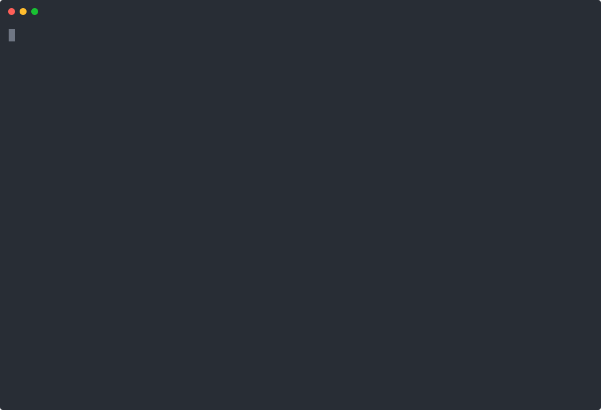
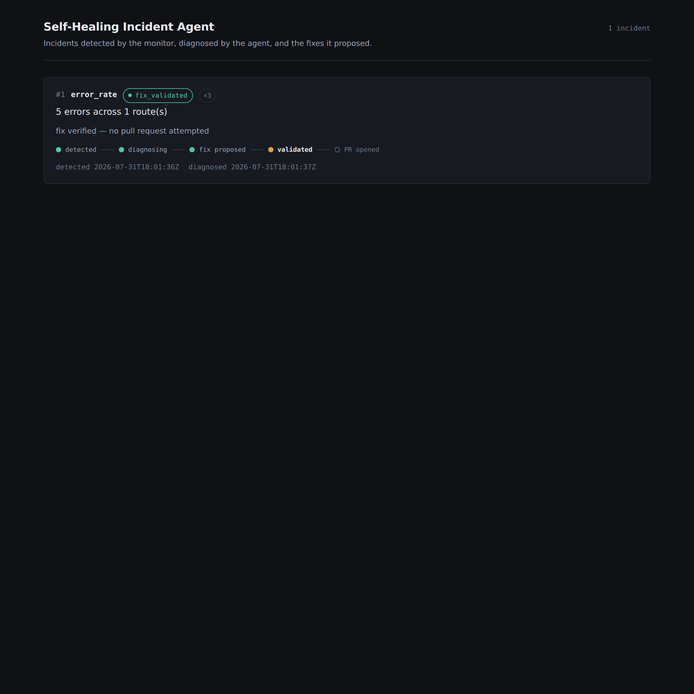
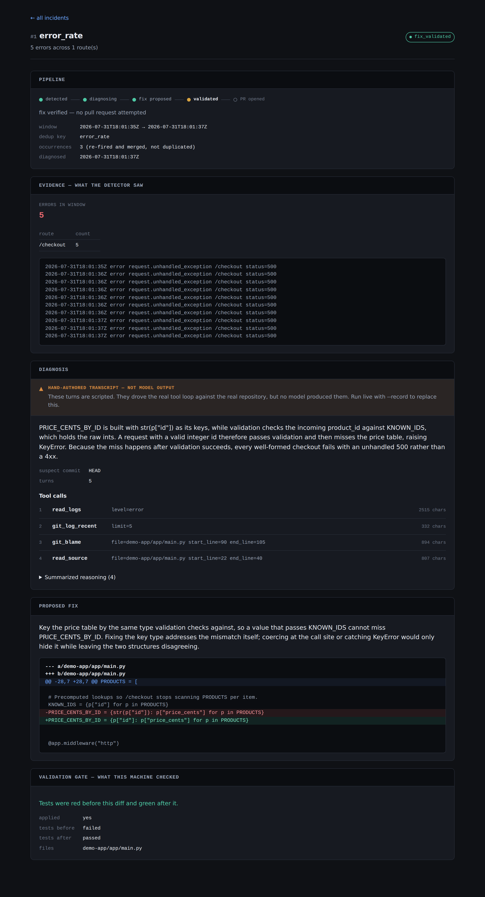

# Self-Healing Incident Agent

An incident-response agent that watches a demo app's logs and metrics, detects
failures, diagnoses root cause by giving Claude real tools (read logs, query
metrics, `git blame`, read source), proposes a concrete fix as a diff, and
opens a pull request with the change and the reasoning behind it. A dashboard
shows each incident move through the pipeline: detected → diagnosing →
diagnosed → fix proposed → PR opened.

The category is real and active — [HolmesGPT](https://github.com/robusta-dev/holmesgpt)
(CNCF Sandbox, SRE agent) and [automatron](https://github.com/creasty/automatron)
ship the same idea commercially. This repo is a scoped, from-scratch version
of it: no agent framework, every layer explicit and explainable end to end.

> **CI:** 



*A real recorded session — `inject_bug.sh` commits the bug, the error-rate
detector fires, the agent drives its read-only tools to a root cause, and the
validation gate proves the proposed diff turns the tests from red to green.*

## Important: the bugs are on purpose

The demo app's failures are **injected as real, deliberate commits**
(`scripts/inject_bug.sh`) — not accidents. That's what makes the whole loop
reproducible: anyone who clones this repo can trigger the same incident,
watch the same detection, and see the same agent diagnosis, every time.
See the bug catalog in `PLAN.md`.

If you see a branch named `demo/b1-<sha>`, or a pull request whose base is
one, that is an injected bug and its fix — deliberate, and never merged
into `main`. CI enforces that: the `guard` job fails any pull request into
`main` whose tree contains a catalogued bug, or that comes from a `demo/*`
branch. Documentation alone wasn't enough — an accidental "Compare & pull
request" click proposed exactly that merge once.

## Architecture

```
demo-app (Python/FastAPI, bugs injected as real commits)
        │  structured JSON logs + /metrics (Prometheus format)
        ▼
monitor (Go daemon)
        │  tails logs, scrapes metrics, sliding-window detectors,
        │  debounce/dedup → writes incident to SQLite
        ▼
agent (Python + Claude function calling)
        │  tools: read_logs · get_metrics · git_log/git_blame ·
        │  read_source · propose_fix(diff)
        │  validates diff (applies + tests pass) → opens PR via GitHub API
        ▼
dashboard (Next.js)
           reads SQLite → incident timeline, tool-call trace, diff view
```

One SQLite file (`incidents.db`) is the contract between the three layers —
no message broker, no services to babysit.

## Repo layout

| Path | What |
|------|------|
| `demo-app/` | Python/FastAPI service with structured logs and a `/metrics` endpoint |
| `monitor/` | Go daemon: log/metric detectors, incident writer |
| `agent/` | Python: Claude tool loop, diff validation, PR opener |
| `dashboard/` | Next.js incident dashboard |
| `scripts/` | `inject_bug.sh`, `run_demo.sh` |
| `docs/` | `design-decisions.md`, architecture notes |
| `PLAN.md` | The full phase-by-phase workmap this project follows |

## Status

**v0.1.0 — the loop is closed end to end.** All five phases are done: the
demo app, the monitor and all three detectors, the diagnosis agent, the
auto-fix step that validates a proposed diff and opens a pull request, and
the dashboard that shows each incident moving through it.

[**PR #6**](https://github.com/1816x/Self-Healing-Agent/pull/6) is the
proof — a one-line fix for the B1 bug, opened by the agent, CI green, and
merged by a human reviewer. The incident behind it walked `detected →
diagnosing → fix_proposed → fix_validated → pr_opened`, and the demo app's
`test_checkout_success` was red before the diff and green after it.

The merge is the step the agent deliberately cannot take. It investigates,
proposes, proves the fix works, and stops — a person decides.

Two honest caveats, both the same shape: **neither outward-facing API call
has ever been made for real.** The environment this was built in has no
model credentials and a proxied GitHub token that rejects direct API
calls, so `LiveCompleter` has never talked to the model API and the PR
opener's own HTTP request has never been accepted by GitHub. Everything
between those two edges is verified against the real thing — real git,
real tests, a real pull request. Details in `PLAN.md`.

See `docs/design-decisions.md` for why the architecture looks the way it
does, including what got rejected.

## The design decisions, in one paragraph each

The long version, with what was rejected and what turned out wrong, is in
`docs/design-decisions.md`. The short version:

- **Go for the monitor** — the observability ecosystem is Go, and the
  monitor is the piece that would live next to Prometheus and Kubernetes.
- **Bugs injected as real commits** — the most interviewable decision here.
  `git blame` is only meaningful if there is a genuinely guilty commit, so
  `inject_bug.sh` commits one with an innocent message. It also means CI has
  to enforce that no injected bug reaches `main`, which it does by
  reverse-applying every catalogued patch against the merge result.
- **One SQLite file as the contract** between Go, Python and TypeScript. No
  broker, no services. Go owns every schema change; the other two assert the
  version they need.
- **Five read-only tools and one gated write.** `propose_fix` is terminal,
  and a diff it produces must apply cleanly *and* turn the tests from red to
  green before a pull request opens. Nothing is ever auto-merged.
- **Offline mode from Phase 3**, so a stranger can run the whole loop with no
  API key — and labelled everywhere it surfaces, because a hand-authored
  transcript must never read as a model diagnosis.
- **The dashboard cannot write.** It opens SQLite read-only; re-running an
  incident is a CLI flag.

## Dashboard

```bash
cd dashboard && npm install && npm run dev     # http://localhost:3000
```

Reads `incidents.db` (override with `INCIDENTS_DB`) and shows each incident's
pipeline state, the agent's tool-call trace, the diff it proposed, and — kept
deliberately separate — what the validation gate independently checked.





The orange banner in the second shot is the point: those turns are a
hand-authored transcript, not model output, and the UI says so above the root
cause rather than in a corner.

## Quickstart

```bash
scripts/run_demo.sh          # terminal 1: demo app + monitor + steady load
scripts/inject_bug.sh b1     # terminal 2: pick one — b1, b2, or b3
```

Within seconds the corresponding detector fires and an incident lands in
`incidents.db`:

| Bug | Regression | Detector |
|-----|-----------|----------|
| `b1` | `/checkout` 500s on every request | `error_rate` (log-based) |
| `b2` | `/products` goes slow (simulated N+1) | `latency_p95` (metric-based) |
| `b3` | in-memory cache grows unbounded | `memory_growth` (metric-based) |

```bash
sqlite3 incidents.db 'SELECT id, kind, status, occurrences, evidence FROM incidents;'
```

**The agent then picks it up on its own** — `run_demo.sh` installs it and
polls for new incidents, so diagnosis needs no second command and no API key.
It claims the incident, drives its read-only tools (`read_logs` →
`git_log_recent` → `git_blame` → `read_source`) against this repository, and
records a root cause plus a proposed diff.

Pass `--no-agent` for detection only, or `--live` to diagnose with a real
model call. To drive it by hand instead:

```bash
cd agent && pip install -e ".[dev]" && cd ..
python -m diagnose --db incidents.db --offline --repo-root .
```

Offline mode tells you what it is: with no recorded model session it either
replays a hand-authored transcript (labeled `source: "replay-scripted"`) or
falls back to rule-based triage that says `NOT A MODEL DIAGNOSIS`. It never
presents scripted turns as model output — see
`agent/diagnose/transcripts/README.md`.

Then ship the fix. The agent applies the diff to a throwaway `git
worktree`, runs the demo app's tests there, and only then offers to open a
pull request:

```bash
scripts/inject_bug.sh b1 --push          # publish the bug to demo/b1-<sha>
python -m diagnose --db incidents.db --offline --dry-run-pr \
    --base-branch demo/b1-<sha>          # see the PR without sending it
python -m diagnose --db incidents.db --offline --open-pr \
    --base-branch demo/b1-<sha>          # actually open it
```

The gate runs every time; `--open-pr` is opt-in, and nothing is ever
merged automatically. A diff that doesn't apply, or that leaves the tests
red, marks the incident `fix_failed` and opens nothing.

**Picking an incident back up.** The demo's poller stops at `fix_proposed`,
because cutting a worktree and running pytest every few seconds unattended is
not something a demo should do. `--resume` is how a stored fix gets driven
through the gate afterwards — it runs the gate over the recorded diff without
calling the model again, since the diff is already there:

```bash
python -m diagnose --db incidents.db --offline --resume --base-branch demo/b1-<sha>
```

The same flag reclaims an incident whose agent process died mid-run, using a
lease on how long it has sat in `diagnosing` (`--lease-age`, default 15m).

**Why the bug gets its own branch.** A fix PR needs a base that actually
contains the bug — against `main` it would revert code `main` has never
had, so it could neither apply nor pass CI. `--push` publishes the
injected commit to `demo/<bug>-<sha>` and the fix PR targets that.
**`main` never carries an injected bug**, and `inject_bug.sh` refuses to
publish from it.

Undo an injection before trying another: `git reset --hard HEAD~1`, and
`git push origin --delete demo/<bug>-<sha>` if you published it.
